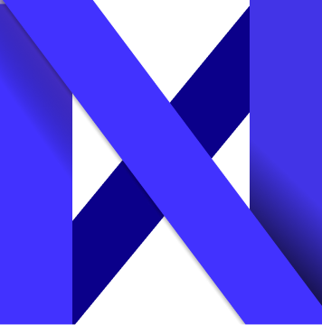

# Connexion
<p align="center">
  
</p>

## Installation
Connexion is deployed [here](https://connexion-app.netlify.app/)

However if you are interested in running the web application locally follow these steps:
1. Make sure Node.js is installed

2. Pull the github repository
    ```
    git clone https://github.com/ReduxLX/connexion.git
    ```
    
3. Move inside the connexion-app directory
    ```
    cd connexion/connexion-app
    ```
    
4. Install project dependencies
    ```
    npm install or yarn
    ```
    
5. Run the application
    ```
    npm start or yarn start
    ```

## About The Project

Connexion represents our final submission for the Monash 2021 Quickhack Hackathon with the topic "Connecting the past, present and future".
We thought of many solutions to this problem but came to a realization that Monash lacked a truly unified platform where current, past and future students could discuss matters freely. Thus this was how Connexion was born.

<p align="center">
  
</p>

On its core, Connexion allows users to view, create and comment on topics based on 5 categories:
  1. General
  2. Future Monashians
  3. Freshmen
  4. Seniors
  5. After Monash

Every topic is assigned between 1 to 3 categories as well as the student's relative campus.
This allows for different users to filter posts based on their preferences. 
For example, an upcoming monash student may only be interested in posts belonging to the Freshmen category for the Malaysian campus.

In order to encourage user interactivity, we designed a simple point system wherein users get points for posting topics, comments, etc..
Users that have contributed the most will obtain a rank on the user weekly leaderboards.

Currently it has the following screens:

- Home Page
- All Categories Page
- Category Page
- Profile Page
- Leaderboard Page
- Sign in / Sign up page
- About page

## Commitment to Responsive design
One of our main goals when starting this project is accessibility. As such, we had dedicated significant portion of our time in order 
to make the app responsive. Here is what the app looks like on a mobile phone

<p align="center">
  
</p>


## Future Plans

During the development of Connexion, we came up with several ideas that could enhance the platform, these include:
- Following other users and visiting their profile to see their latest activity
- Direct chatting system between users reminiscent of Instagram or LinkedIn
- Suggesting existing similar topics during post creation to avoid redundancy
- Bookmarking posts to keep track of large threads
- Replying to user comments on posts
- Editing and Deleting posts and comments

Furthermore since this project is built using React, it will be relatively easy to make a cross-platorm app for both Android and IOS
using React Native due to both frameworks being very similar.
Alternatively, we have also been thinking of experimenting with creating Progressive web apps.

Overall, we think this project has a lot of potential going forwards.
We definitely learnt a lot of things during the 2-week development of this project and would be eager
to see what how we can extend this project in the future.

## Built With

- [React.js](https://reactjs.org/)
- [Material UI](https://material-ui.com/)
- [Firebase](https://firebase.google.com/)

